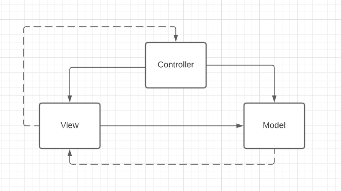
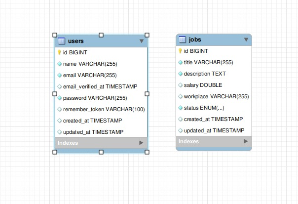

# Talentify Jobs
## Install
### Copy .env.example file to .env
```bash
cp .env.example .env
``` 
### Docker
```bash
docker-compose up -d --build
``` 
### Composer install
```bash
docker-compose run php php composer.phar install
```
### Structure and data of the databases
```bash
docker-compose run php php artisan migrate:fresh --seed
``` 
### If an error appears, change APP_DEBUG to true

Common error is permission on the storage folder
```bash
sudo chmod -R 766 storage/
``` 
## RUN
Access the server as http://localhost, remembering that port 80 must be open.

If you want to change the port, you must change the .env file and the docker-compose.yml.
## Tests
If you do the test it will clean the database. So you have to run the migration again.
```bash
sudo docker-compose run php php vendor/bin/phpunit
``` 

## Architecture 
### Lavavel Framework MVC

### UML

