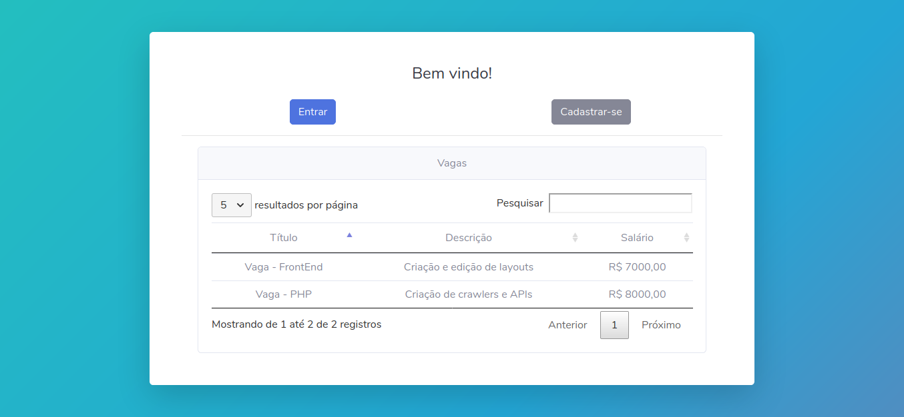
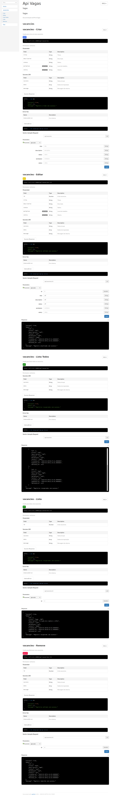

# Sistema de Vagas com Laravel
> Sistema simples feito com laravel para listar vagas

# DEMO
[https://vagas-laravel.herokuapp.com/](https://vagas-laravel.herokuapp.com/)

## Iniciando projeto

```
git clone https://github.com/walternascimentobarroso/vagas-laravel.git .
composer install
cp .env.example .env
```
### Conectando com o banco de dados

No arquivo .env modifique os campos:

DB_HOST=<kbd>host</kbd>  
DB_PORT=<kbd>porta</kbd>  
DB_DATABASE=<kbd>base</kbd>  
DB_USERNAME=<kbd>usuario</kbd>  
DB_PASSWORD=<kbd>senha</kbd>

```
php artisan key:generate
php artisan serve
http://127.0.0.1:8000
```

> Se prefirir pode usar docker
```
docker-composer up -d
http://127.0.0.1
```

### Página inicial
https://vagas-laravel.herokuapp.com/

### Página para testar api 
https://vagas-laravel.herokuapp.com/api/vacancies

## Testes
> Digite o comando na raiz do projeto
```
./vendor/bin/phpunit
```

## Documentação para API
__É necessário ter o apidoc instalado antes `npm i -g apidoc`__
```
cd doc/apidoc
apidoc -i ../../routes/ -o ../../public/apidoc/
```
https://vagas-laravel.herokuapp.com/apidoc/

## Captura de tela - Página Inicial


## Captura de tela - Documentação API

